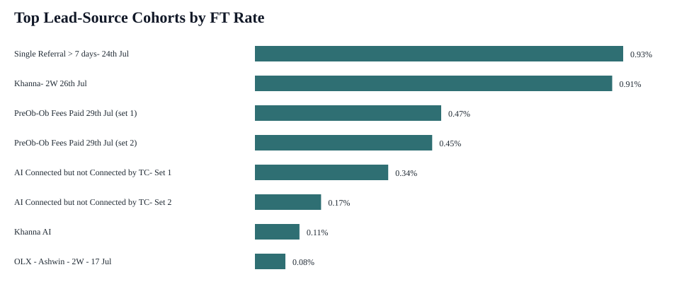
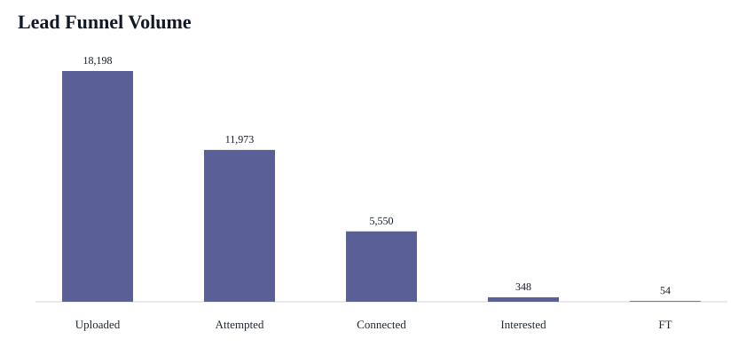

# Vahan Product Analytics Internship Case Study

## Summary
The raw dataset contains 18,198 lead rows across 16 lead-source cohorts from 2026-07-18 to 2026-08-06. Overall FT-after-upload conversion is low at 0.30% (54 FTs from 18,198 uploaded leads).

For ranking cohorts, I used FT-after-upload rate as the main metric, with a small volume adjustment. That keeps the ranking focused on final conversion quality while avoiding tiny cohorts that look good only because of small sample size.

## Top 3 Cohorts

| Rank | Lead source | Uploaded leads | FT after upload | FT rate | Attempt rate | Connect rate | Score |
|---:|---|---:|---:|---:|---:|---:|---:|
| 1 | Single Referral > 7 days- 24th Jul | 1,500 | 14 | 0.93% | 96.93% | 47.46% | 0.0080 |
| 2 | Khanna- 2W 26th Jul | 1,546 | 14 | 0.91% | 89.00% | 41.72% | 0.0078 |
| 3 | PreOb-Ob Fees Paid 29th Jul (set 1) | 1,483 | 7 | 0.47% | 96.63% | 45.36% | 0.0040 |

## Funnel Readout

- Uploaded leads: 18,198
- Attempted: 11,973 (65.79%)
- Connected: 5,550 (46.35% of attempted)
- Interested: 348 (6.27% of connected)
- FT after upload: 54 (0.30% of uploaded)
- FT after first attempt: 17 (0.14% of attempted)

## SQL / Aggregate Table

The SQL query is saved in `aggregation_query.sql`. The aggregate output is saved in `cohort_aggregation.csv` and `vahan_case_study_outputs.xlsx`.

## FT Prediction Model

I treated `FT_after_upload` as the target. The better performing model was `logistic_regression`, with the decision threshold tuned on a validation split at 0.83. Since only a small fraction of leads become FT, I would not judge this model by accuracy alone. The more useful readout is whether the score can help prioritize a smaller set of leads.

| Metric | Value |
|---|---:|
| accuracy | 0.9423 |
| precision | 0.0050 |
| recall | 0.0909 |
| f1 | 0.0094 |
| roc_auc | 0.7603 |

Confusion matrix on 20% holdout test set:

| Actual \ Predicted | Not FT | FT |
|---|---:|---:|
| Not FT | 3429 | 200 |
| FT | 10 | 1 |

Main factors picked up by the model:

| Rank | Feature | Importance |
|---:|---|---:|
| 1 | cat__lead_source_AI Connected band Not Interested | 3.9835 |
| 2 | cat__lead_source_AI Connected but not Connected by TC- Set 1 | 3.0588 |
| 3 | cat__lead_source_2W3W - 3WCNG - Khanna - 3W - 17 Jul | 3.0402 |
| 4 | num__Attempted | 2.9032 |
| 5 | cat__lead_source_2W3W - 3WAHD - Khanna - 3W - 17 Jul | 2.8648 |
| 6 | cat__lead_source_Khanna AI | 2.7822 |
| 7 | cat__lead_source_Single Referral > 7 days- 24th Jul | 2.5707 |
| 8 | cat__lead_source_2W3W - 3WEV - Khanna - 3W - 17 Jul | 2.3909 |
| 9 | num__tag_filled | 1.7615 |
| 10 | num__Connected | 1.3413 |
| 11 | cat__lead_source_PreOb-Ob Fees Paid 29th Jul (set 1) | 0.7763 |
| 12 | num__upload_day_of_week | 0.7093 |

Prioritization readout:

- Test-set base FT rate: 0.30% (11 positives).
- Top 10% scored leads: 0.82% FT rate, 2.73x lift, 3 captured positives.
- Top 20% scored leads: 0.82% FT rate, 2.73x lift, 6 captured positives.

## Assumptions

- `FT_after_upload` is treated as the main business outcome.
- Cohorts are aggregated at `lead_source` level because the brief asks for lead-source cohort performance.
- Post-outcome fields such as `FT_after_first_attempt`, `OB_after_upload`, and conversion-to-FT percentage columns are excluded from model features to reduce leakage.
- FT is a rare outcome in this sample, so the model is best used for prioritization, not as a final automated decision rule.
- If the real constraint is caller capacity, I would also track attempted volume and connect rate alongside FT rate.

## Recommendation

I would prioritize the top 3 cohorts above for near-term sourcing, with weekly monitoring so the ranking does not overreact to small changes. FT rate should be the quality metric, while attempt and connect rates should be used to diagnose execution issues in the calling funnel.
